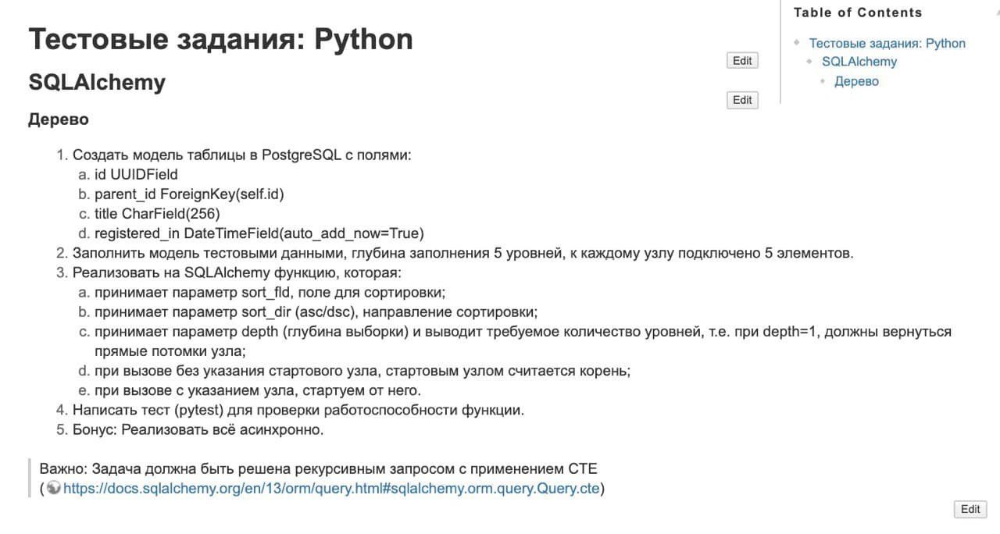

# SqlAlchemy test task

### Задание



### Установка

```bash
poerty install
```

### Запуск

Создать и заполнить файл `.env`. Переменные можно посмотреть в файле `example.env`

```bash
poetry run alembic upgrade head
poetry run python main.py
```

Доступные опции:
* `--sort-fld SORT_FLD  sorting field`
* `--sort-dir SORT_DIR  sorting direction`
* `--depth DEPTH        depth`
* `--node NODE_ID       start node`

### Запуск тестов

```bash
poetry run pytest
```
